# 🏟️ BOMBONERA SIGLO XXI - Proyecto de Ampliación y Modernización de La Bombonera

## Descripción del Proyecto

Este repositorio contiene el resultado del trabajo práctico **PF02 - Prompt Engineering**.

El proyecto consiste en una Landing Page institucional desarrollada mediante Inteligencia Artificial para presentar una propuesta conceptual inspirada en el proyecto de ampliación y modernización de La Bombonera impulsado por la actual gestión de Boca Juniors.

La landing busca comunicar los objetivos del proyecto, sus beneficios para socios e hinchas, las mejoras tecnológicas previstas y la visión de futuro para el estadio, manteniendo la identidad histórica del club y su permanencia en el barrio de La Boca.

---

# 👨‍🎓 Datos del Estudiante

* **Nombre:** Federico Lynch
* **Carrera:** Tecnicatura en Desarrollo de Software
* **Materia:** Front-End II
* **Trabajo Práctico:** PF02 - Prompt Engineering
* **Año:** 2026

---

# 📂 Repositorio GitHub

https://github.com/LynchFede/PFO2_Lynch

---

# 🌐 Deploy Unificado - Vercel

https://pfo-2-lynch.vercel.app

El deploy unificado contiene una portada principal desde la cual se puede acceder a:

* Prompt utilizado.
* Landing Page generada por GPT-5.5.
* Landing Page generada por OpenCode Zen.

---

# 🤖 Agentes Utilizados

## Agente 1

* **Agente:** Codex / OpenAI
* **Modelo:** GPT-5.5
* **Landing:** https://pfo-2-lynch.vercel.app/PFO2_Lynch_original/index.html

## Agente 2

* **Agente:** OpenCode Zen
* **Modelo:** Big Pickle
* **Landing:** https://pfo-2-lynch.vercel.app/PFO2_Lynch_OpenCode/index.html

---

# 📝 Prompt Utilizado

El prompt completo utilizado se encuentra disponible en el archivo:

**prompt.txt**

El mismo prompt fue utilizado para ambos agentes de Inteligencia Artificial, con el objetivo de comparar los resultados obtenidos a partir de una misma consigna.

---

# 📸 Capturas de Pantalla

> GitHub no permite aplicar animaciones CSS o JavaScript dentro del README.
> Para lograr un efecto de movimiento real se debería subir un archivo `.gif`.
> En este caso se muestran las capturas ordenadas de cada landing para visualizar el recorrido completo de ambas páginas.

---

## Landing Generada por GPT-5.5

<p align="center">
  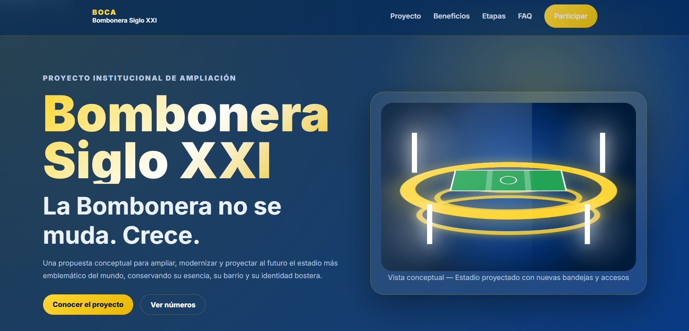
</p>

<p align="center">
  
</p>

<p align="center">
  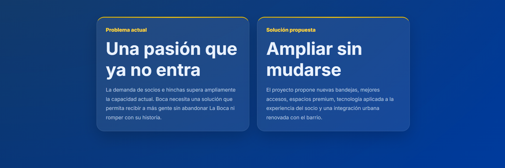
</p>

<p align="center">
  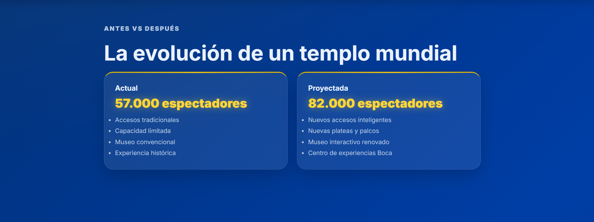
</p>

<p align="center">
  
</p>

<p align="center">
  
</p>

<p align="center">
  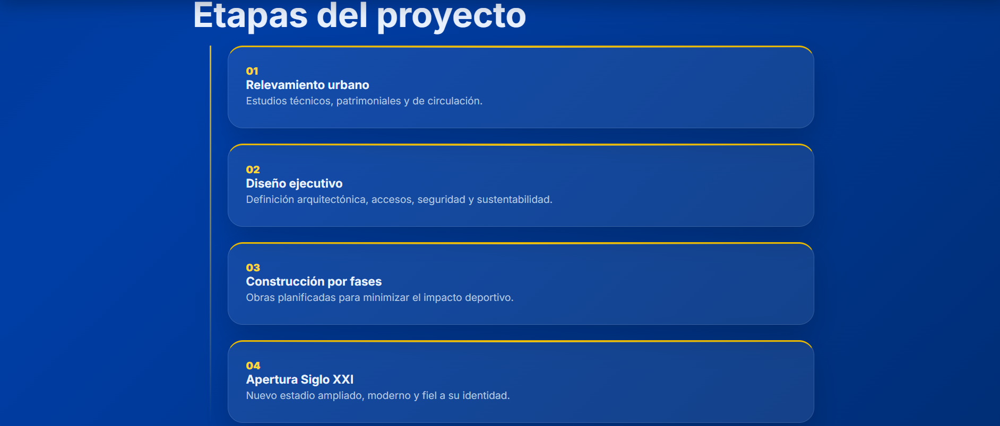
</p>

<p align="center">
  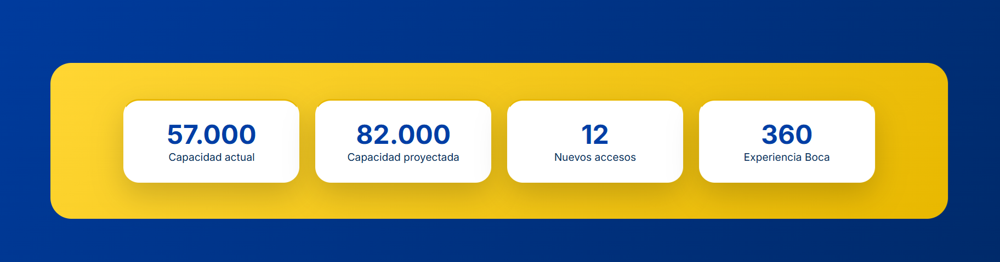
</p>

<p align="center">
  
</p>

<p align="center">
  
</p>

<p align="center">
  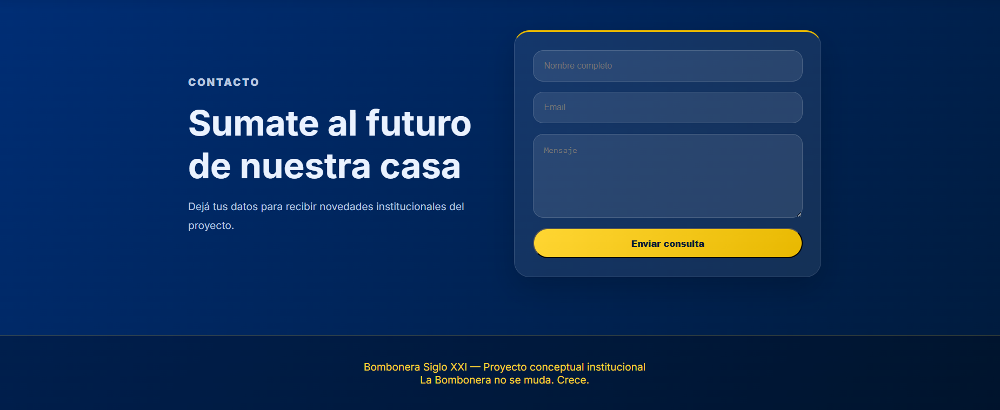
</p>

---

## Landing Generada por OpenCode Zen

<p align="center">
  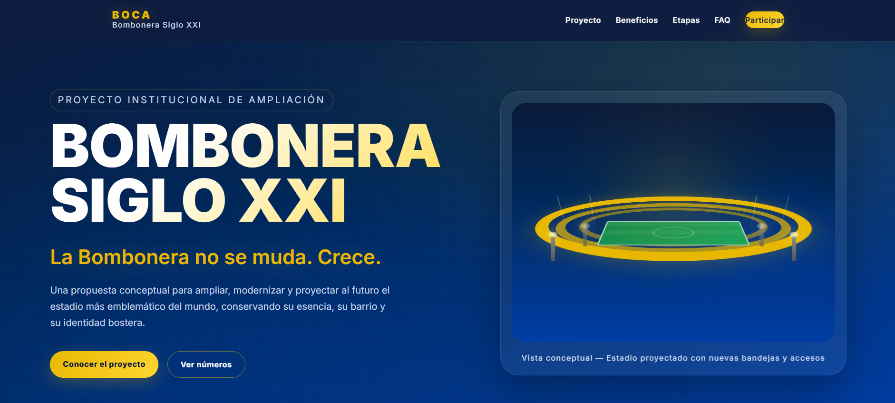
</p>

<p align="center">
  
</p>

<p align="center">
  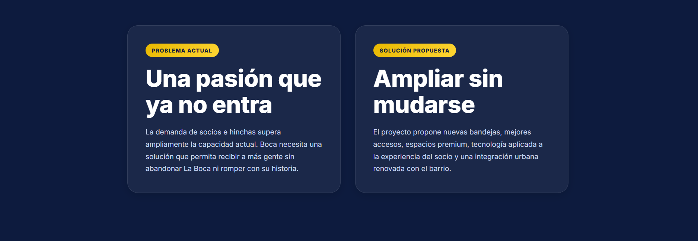
</p>

<p align="center">
  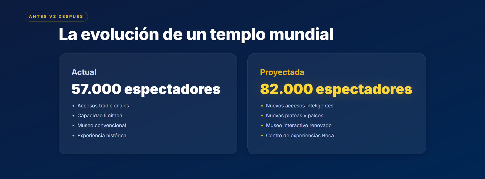
</p>

<p align="center">
  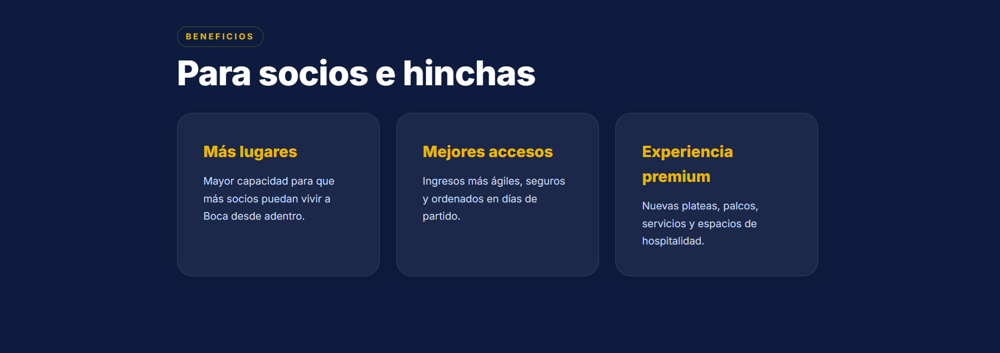
</p>

<p align="center">
  
</p>

<p align="center">
  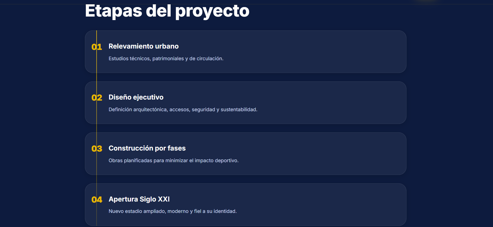
</p>

<p align="center">
  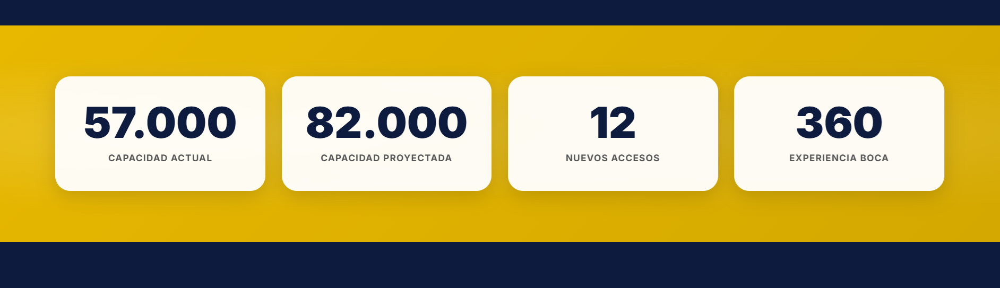
</p>

<p align="center">
  
</p>

<p align="center">
  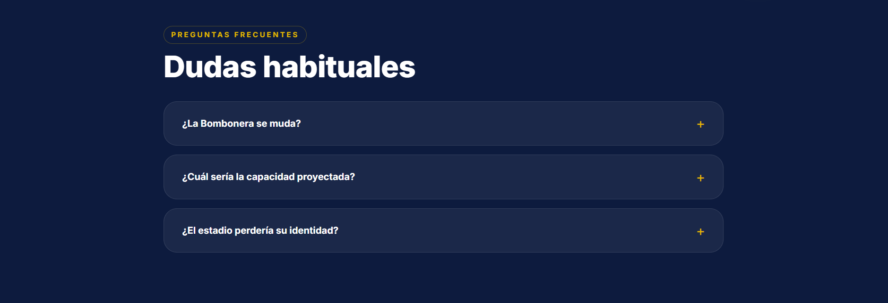
</p>

<p align="center">
  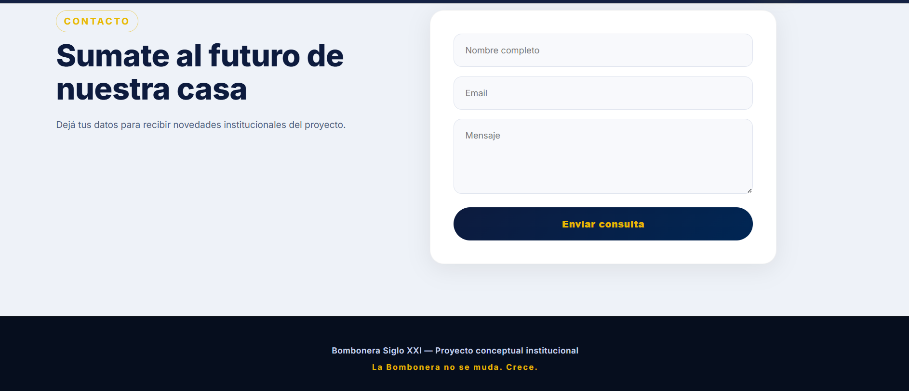
</p>

---

# 🛠️ Tecnologías Utilizadas

* HTML5
* CSS3
* JavaScript Vanilla
* Responsive Design
* GitHub
* Vercel
* Inteligencia Artificial Generativa

---

# 📁 Estructura del Proyecto

```text
PFO2_Lynch/
│
├── index.html
├── README.md
├── prompt.txt
│
├── capturas/
│   ├── gpt55_1.png
│   ├── gpt55_2.png
│   ├── gpt55_3png.png
│   ├── gpt55_4.png
│   ├── gpt55_6.png
│   ├── gpt55_7.png
│   ├── gpt55_8.png
│   ├── gpt55_9.png
│   ├── gpt55_10.png
│   ├── gpt55_11.png
│   ├── gpt55_12.png
│   ├── opencode_1.png
│   ├── opencode_2.png
│   ├── opencode_3.png
│   ├── opencode_4.png
│   ├── opencode_5.png
│   ├── opencode_6.png
│   ├── opencode_7.png
│   ├── opencode_8.png
│   ├── opencode_9.png
│   ├── opencode_10.png
│   └── opencode_11.png
│
├── PFO2_Lynch_original/
│   ├── index.html
│   ├── style.css
│   └── script.js
│
└── PFO2_Lynch_OpenCode/
    ├── index.html
    ├── style.css
    └── script.js
```

---

# 🎯 Objetivo Académico

Comparar los resultados obtenidos mediante Ingeniería de Prompts utilizando distintos agentes de Inteligencia Artificial.

El trabajo permite observar diferencias en:

* Diseño visual.
* Estructura de la información.
* Experiencia de usuario.
* Organización del código.
* Estilo gráfico.
* Interpretación del prompt.
* Calidad de implementación.

---

# ✅ Conclusión

La realización de este trabajo permitió aplicar conceptos de Ingeniería de Prompts y comparar cómo diferentes agentes de Inteligencia Artificial interpretan una misma consigna.

A partir del mismo prompt, cada agente generó una propuesta visual diferente para una landing page institucional sobre el proyecto conceptual de ampliación y modernización de La Bombonera.

El deploy unificado permite acceder de forma clara al prompt utilizado y a ambas versiones generadas, facilitando la comparación entre los resultados.
